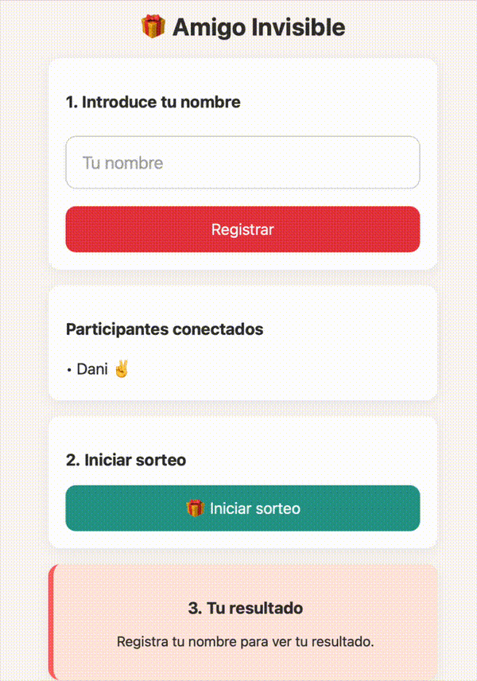
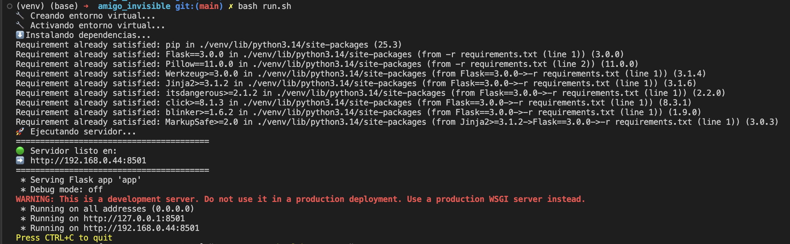
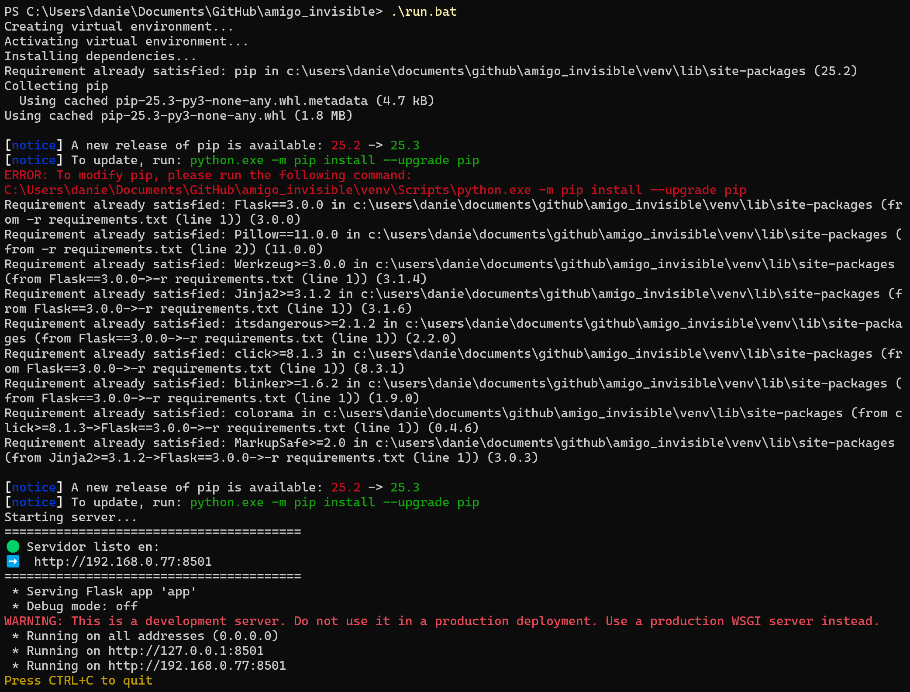
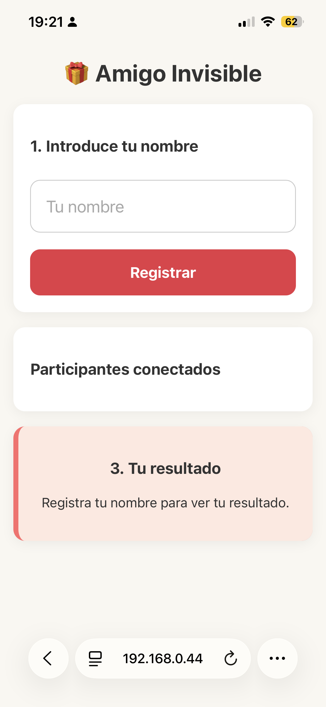
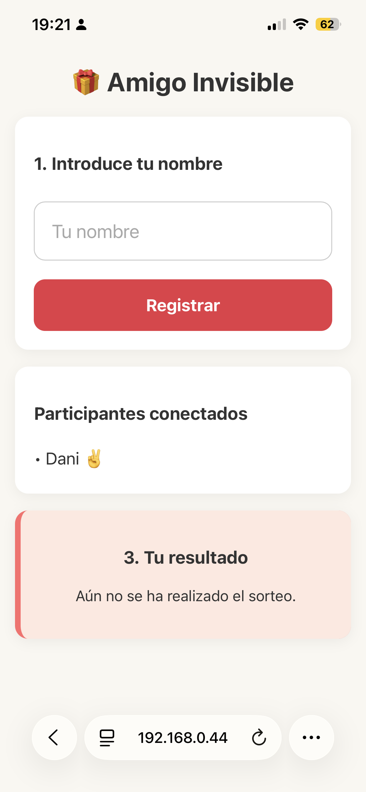
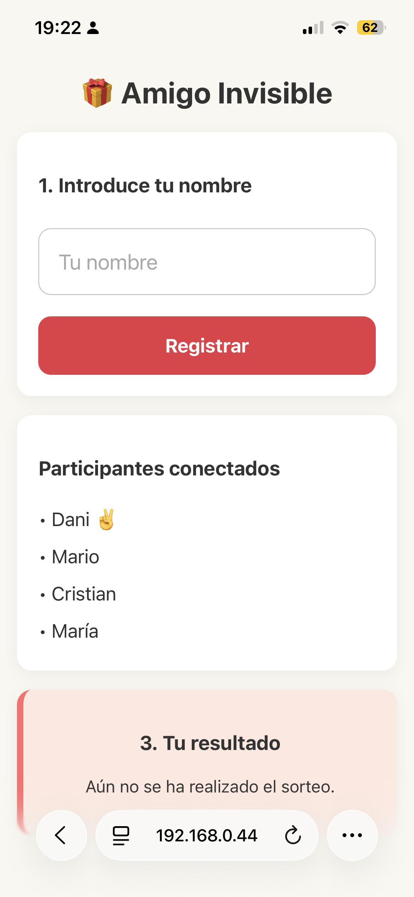
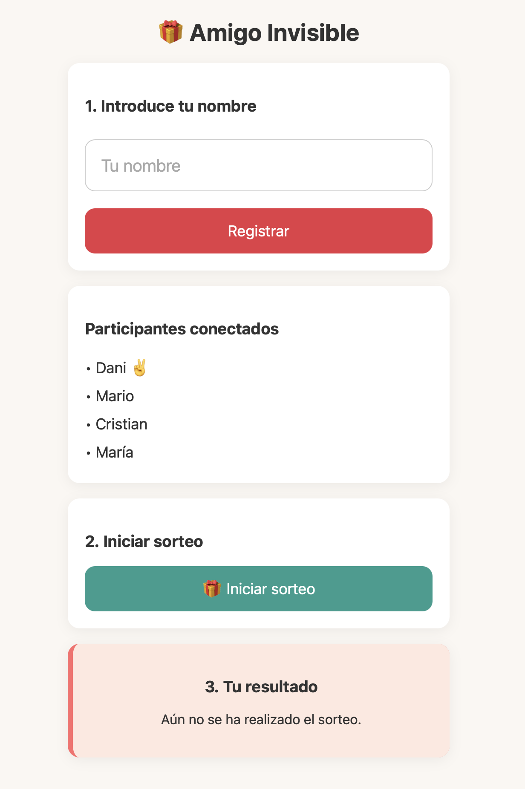
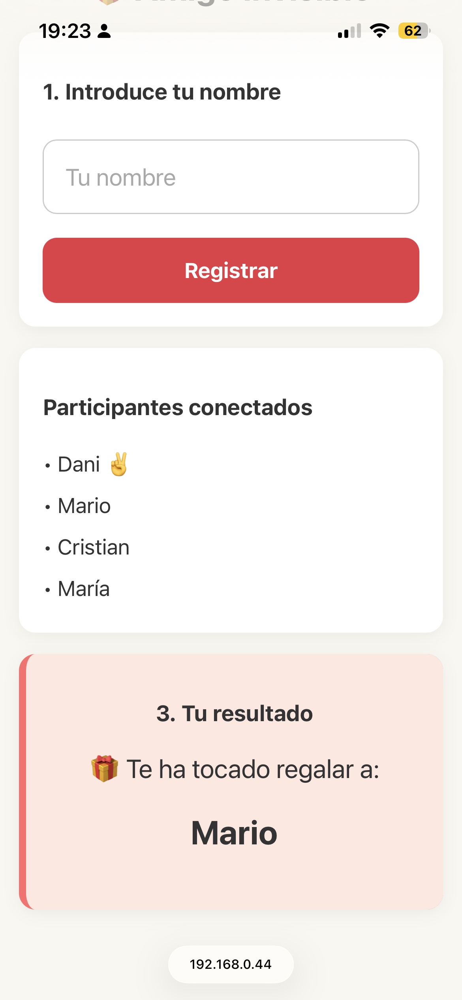

# Amigo Invisible con amigos y familiares 🎁

Cada diciembre aparece el mismo dilema: ¿quién hace el sorteo sin acabar viendo todo?

Si lo haces a mano, alguien se repite, a otro le toca a sí mismo y terminas dando mil vueltas hasta que “más o menos queda bien”.
Para los frikis de la informática, esto es una oportunidad perfecta: automatizarlo.

Este proyecto es un pequeño servidor local donde cada participante se conecta desde su móvil, introduce su nombre y recibe su asignación de forma totalmente anónima. Sin repeticiones, sin trampas y sin que nadie conozca más de lo que le toca.



## Descripción técnica

Script sencillo para arrancar la aplicación localmente. Ejecuta todo automáticamente: crea un entorno virtual, instala dependencias, arranca un servidor Flask, detecta la IP local y muestra la URL para compartir.


# Ejecutar en macOS / Linux
---
1. Dar permisos de ejecución (si es necesario):
```
chmod +x ./run.sh
```
2. Ejecutar:
```
./run.sh
```



# Windows

En una terminal de Windows ejecuta desde una terminal en el directorio del repositorio:
```
run.bat
```
Se creará el entorno virtual, instalará dependencias y arrancará el servidor.




Ejemplo de salida
---
🟢 Servidor listo en:  
➡️  http://192.168.0.44:8501  
Comparte esa URL con los demás (por WhatsApp funciona perfecto).

Conexión desde el móvil
---
Ahora todos tus familiares y amigos podrán conectarse a la web que aloja tu ordenador para repartir a el amigo invisible. Cada uno ha de seguir los simples siguientes pasos:
- Estar en la misma red Wi‑Fi que el ordenador
- Abrir en su navegador la URL:

Ejemplo:
```
http://192.168.0.44:8501
```
Obtendrán la siguiente página:



Cada participante introduce su nombre:



Y una vez todos los participantes estén listos:



El host ya podrá iniciar el sorteo:



Aparecerá una cuenta atrás:


Y cada participante verá individualmente y sin que el resto se entere, a quién le tendrá que preparar una sorpresa. Puedes hacerle un captura de pantalla para no olvidarlo para que se guarde en la galería del móvil.

